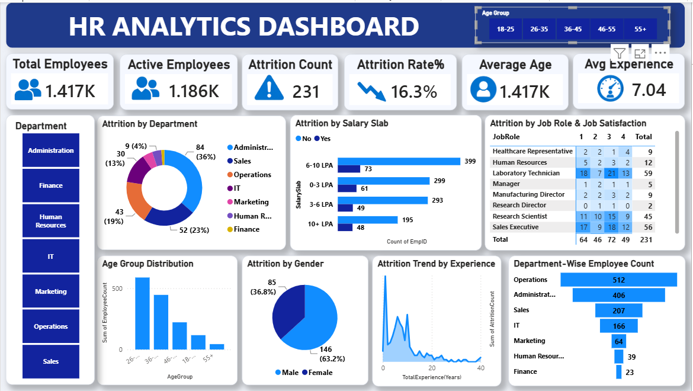

# HR Analytical Dashboard – Power BI

An interactive HR Analytical Dashboard built using Microsoft Power BI to analyze employee data, workforce demographics, attrition, job roles, salary slabs, job satisfaction, and departmental trends.

## Project Overview

This dashboard provides an interactive view of key HR metrics and helps identify employee attrition patterns across different departments, job roles, age groups, salary slabs, gender, and experience levels.

## Tools & Technologies

- Microsoft Power BI
- Power Query
- DAX
- Data Visualization

## Key HR Metrics

- Employee Count
- Active Employees
- Employee Attrition
- Attrition Rate
- Average Years at Company

## Dashboard Analysis

The dashboard includes analysis of:

- Department-wise attrition
- Salary slab and attrition analysis
- Job role and job satisfaction
- Age-group distribution
- Gender-wise attrition
- Total experience and attrition
- Department-wise employee distribution

## Interactive Features

- Department slicer
- Age Group slicer
- Interactive charts
- KPI cards
- HR data analysis using DAX measures

## Dashboard Preview

## Project File

- `HR Analytical Dashboard.pbix` – Power BI dashboard file

## Skills Demonstrated

- Data Analysis
- Data Cleaning and Transformation
- DAX
- Power BI Dashboard Development
- Data Visualization
- HR Analytics
- Interactive Reporting

## Author

**Manisha Ghodake**

GitHub: [Manisha611](https://github.com/Manisha611)
